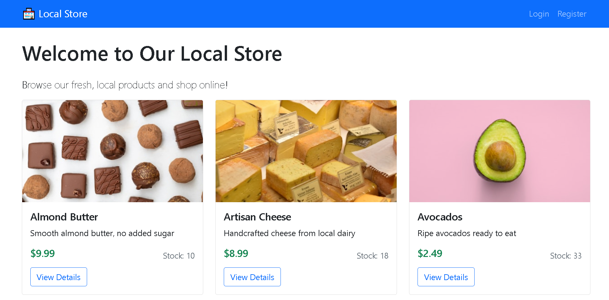
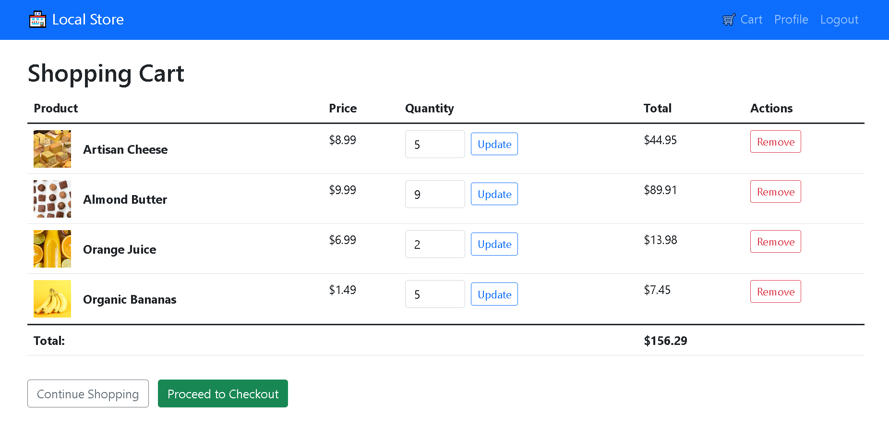
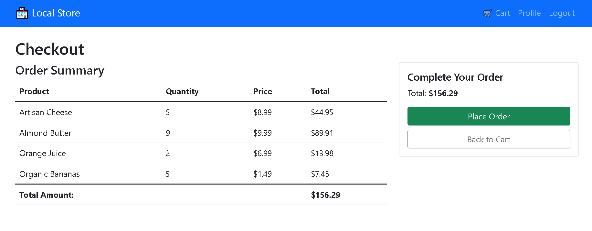

# 🛒 Local Store E-Commerce Website

A simple yet functional e-commerce website built with **Flask** for a local store.  
It allows customers to browse products, add them to their cart, and complete purchases — all in a clean and responsive interface.

---

## ✨ Features

- **Browse Products** – View the store’s catalog with product details.
- **Add to Cart** – Seamlessly add products to your shopping cart.
- **Cart Management** – Update quantities or remove products.
- **Purchase** – Simulated checkout process.
- **Session-based Cart** – Items persist across pages using Flask sessions.

---

## 🛠️ Tech Stack

- **Backend:** Flask
- **Frontend:** HTML, CSS, Bootstrap
- **Database:** SQLite (via CS50 library)
- **Session Management:** `Flask-Session`

---

## 📦 Dependencies

This project requires:

- [`cs50`](https://pypi.org/project/cs50/)
- [`flask`](https://pypi.org/project/Flask/)
- [`flask_session`](https://pypi.org/project/Flask-Session/)
- [`werkzeug.security`](https://werkzeug.palletsprojects.com/)

You can install them with:

```bash
pip install cs50 flask flask_session werkzeug
```

---

## 📂 Project Structure
```
.
├── app.py                # Main Flask application
├── templates/            # HTML templates (Jinja2)
├── screenshots/            # Screenshots folder
├── requirements.txt      # Project dependencies
├── store.db      # SQLite database
└── README.md             # This file
```

---

## 🚀 Getting Started

### 1️⃣ Clone the Repository
```bash
git clone https://github.com/ridael0/PRODIGY_FS_03.git
cd PRODIGY_FS_03
```

### 2️⃣ Install Dependencies
```bash
pip install -r requirements.txt
```

### 3️⃣ Run the Application
```bash
flask run
```
#### By default, it will be available at:
#### ➡️ http://localhost:5000

---

## 📸 Screenshots



---

## 📜 License
### This project is licensed under the MIT License — feel free to use and modify it.

---

## 💡 Notes
- The purchase flow is simulated and does not include real payment integration.
- You can extend it with authentication, order history, and payment gateways like Stripe or PayPal.

---

## ✨ Author
### Mohamed Rida Elaaich
#### Full-stack developer passionate about secure web applications.